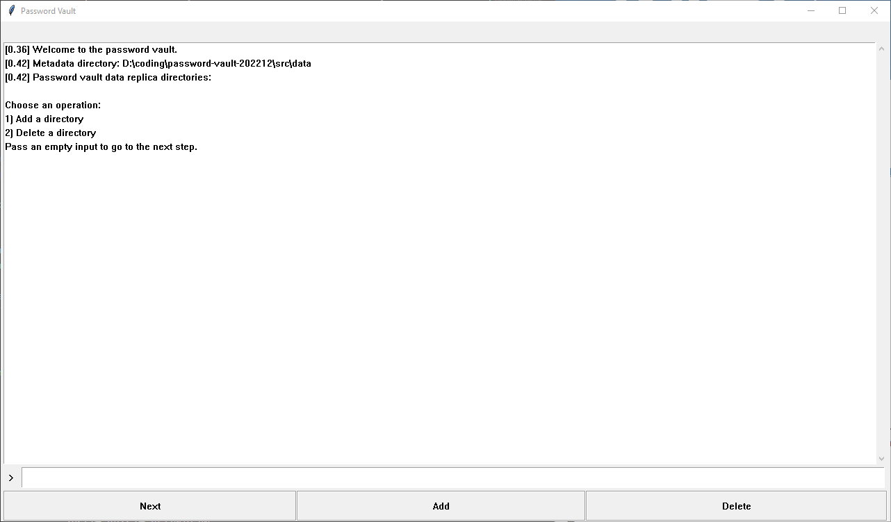
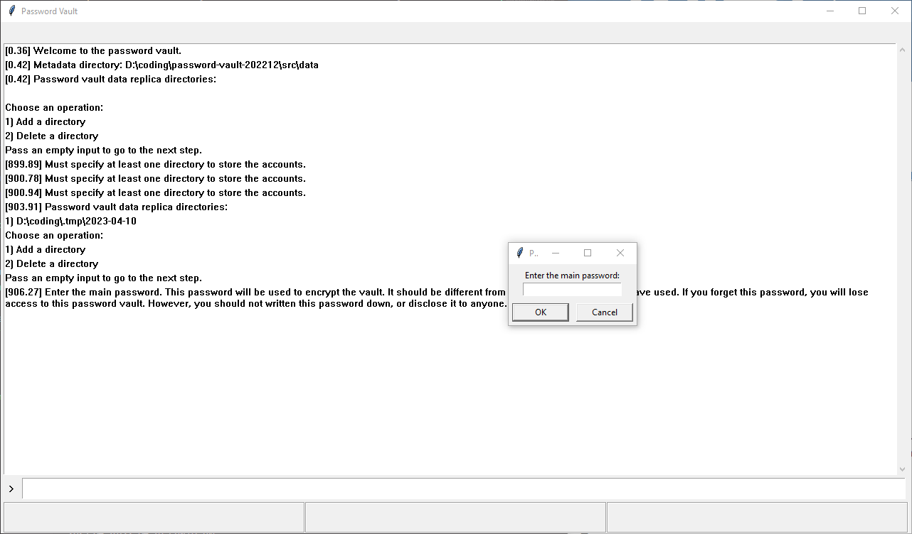
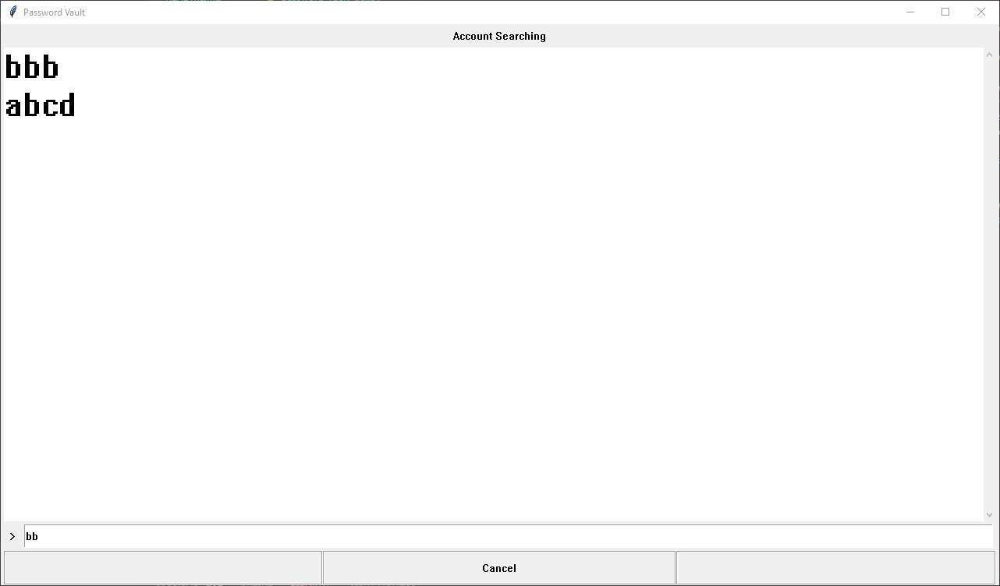
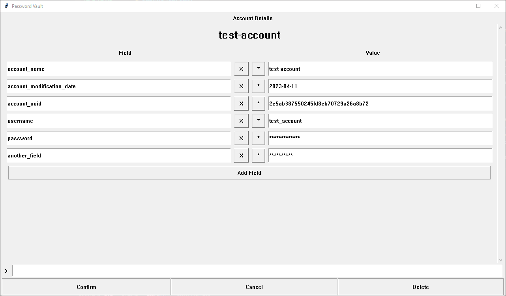

# password-vault-202212

# Table of Contents
- [About](#about)
- [Get started](#get-started)
  - Run the app via source code
  - Run the app via executable
  - GUI explanation

# About
A password vault with simple GUI. No feature at all. Just a good DIY project to consolidate the usage of inheritance in OOP, and FSM.

This password vault utilizes the `ChaCha20` module provided by [PyCryptodome](https://www.pycryptodome.org/) as the encryption algorithm.

# Get Started

## Run the app via source code
1. Ensure Python with version >= 3.10 installed.
1. Clone this repository to the target directory.
1. At the project directory, run `python src\main_gui.py`.

## Run the app via executable
Todo...

## GUI explanation
1. At the directory where the executable is located, if there is a sub-directory named "data/", the password vault will treat it as the location of storing the metadata. If the sub-directory does not exist, it will prompt to ask for the directory where "metadata.json" is or should be stored.
1. If the metadata directory contains a file named "metadata.json", the password vault will read the file, otherwise, it will create one automatically. "metadata.json" consists of two fields, "directories" and "aux_password".
  - "directories" is a list of directories where encrypted account data are stored. Each directory is a replica of one another, so it could reduce the chance of data loss.
  - "aux_password" is a string generated automatically that is to combine with your own password to encrypt the data. It is not something to be remembered. In the context of multi-factor authentication, the "aux_password" is something you have, while your password is something you know. They combine to strengthen the security.
1. The program will wait until you confirm the choice of directories where account data are stored. You can add and/or delete the directories.
  - 
1. Next, the program will ask for your password. If your data directories are empty, it will be the password to encrypt the account data. Else, it will check whether it is the correct password to decrypt existing data in the directories.
  - 
1. Afterwards, it is the main menu that lists the operations that you can perform on the password vault. By now, only `option 1` is functionable, which allows a user to search / add / delete / modify an account. Entering "1" and presses the "enter" button, or passing an empty input in the console, will both lead you to that account searching view.
1. In the account searching view, it is blank before you enter any character. If you want to add an account, enter the name of the account and press the "enter" button. If you want to delete or modify an existing account, search for its name and press the "enter" button. The console will print out the best matched candidates when you change the input.
  - 
1. Entering the account details view, we can add, delete or modify the fields of the account details by using the GUI. We can also delete the account. By clicking the "confirm" button, the updated account details will be stored.
  - 
